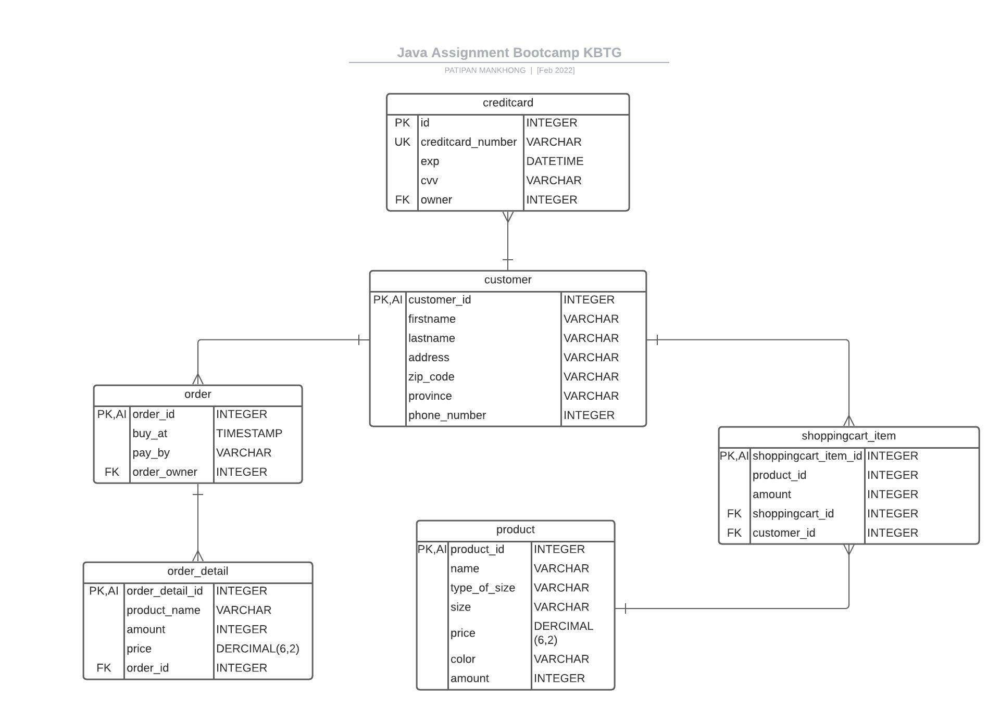

# Design Model

## คำอธิบาย

ออกแบบการเลือกซื้อสินค้าและชำระด้วยบัตรเครดิต มี model สำหรับเก็บข้อมูล ดังต่อไปนี้

## WorkFlow

- customer search สินค้าที่ต้องการซื้อด้วยชื่อ
- customer เจอสินค้าที่อยากและได้เห็นรายละเอียดของสินค้า
- customer add สินค้าลงตะกร้า
  - customer อาจเปลี่ยนใจ remove สินค้าออกจากตะกร้าได้
  - customer อาจเปลี่ยนใจ add สินค้าเพิ่มได้
- customer เช็ึครายะเอียดสินค้าที่อยู่ในตะกร้าก่อน checkout
- customer ชำระสินค้า
- customer ใส่ที่อยู่ในการจัดส่งสินค้า
- customer ชำระสินค้าด้วยบัตรเครดิตแล้วกรอกข้อมูลของบัตร
- customer กดชำระสินค้าแล้วโชว์ผลการชำระเงิน ที่อยู่ ของ customer

## ER Diagram

## Feature
### Search Product by Name flow

- ค้นหา product ด้วยชื่อของสินค้า

endpoint สำหรับ search product by name โดยส่งเป็น query string 

``
GET http://localhost:8080/product/search?keyworad={keyworad}
``

###Choose product flow

- เมื่อเลือกสินค้าได้แล้วให้แสดงรายละเอียดของสินค้า

``
GET http://localhost:8080/product/{id}
``
 